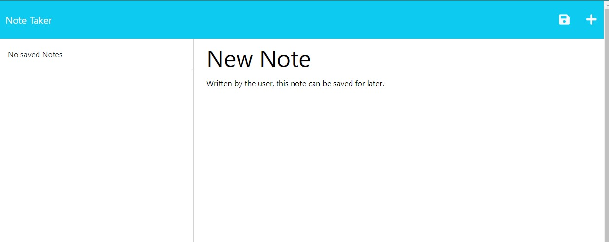
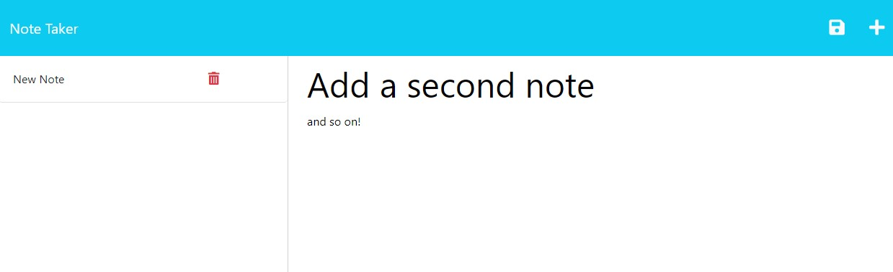

# Express.js Note Taker

## Description
This note taker allows a user to add and delete notes to be stored for future reference. This UT Austin full-stack bootcamp project was primarily focused on joining together a full-stack application and creating the proper HTML and API routing. (As we had not covered databases at the time of this project, a hard-coded js file was used as a "database" for storing objects.)

Deployment for this application is no longer maintained. 

I ran out of time for this project, but would have liked to have added back-end routing for the deletion of tasks from the task list. I also would have modularized more of the back-end routing. Instead of doing so, however, I plan to rebuild this application using different technologies.

## Installation
No installation necessary.

## Usage
The user is able to click through from the landing page to access the notes page. 

By clicking on the save button (an image of a floppy disk), the user can save their notes for later. On the backend, this submission is stored in a database, making it accessible at any time when the application is deployed to the server. 

## Credits 
The following starter codes were provided by UT Austin Fullstack Bootcamp:
- HTML starter code for the index.html and notes.html files
- CSS starter code for the styles.css file
- Javascript starter code for the index.js and fsUtils files

It also uses NPM modules Express and uuid. 

## License 
An [MIT license](https://github.com/aomaits/Express.js-Note-Taker/blob/main/LICENSE) was used for this project. 